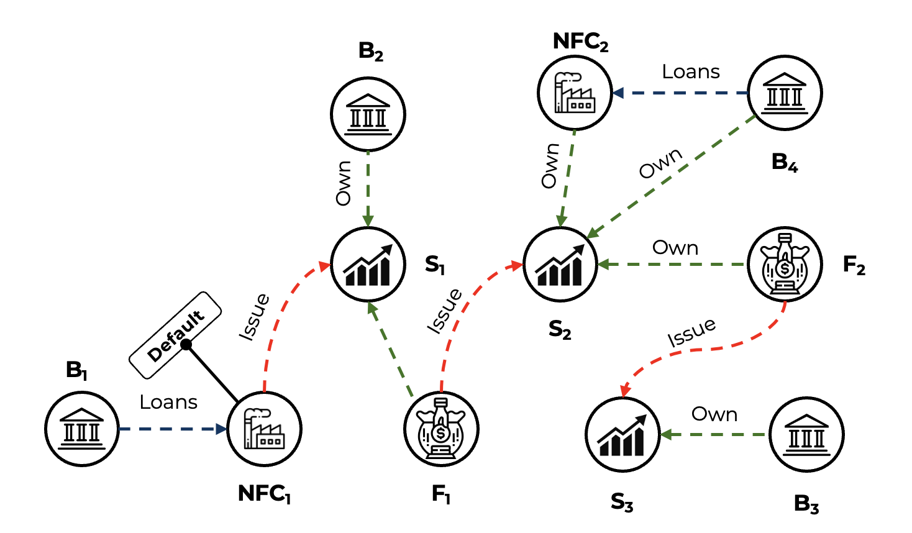

# Non-Performing Loans

Let's consider a financial system composed of banks, non financial corporations
(NFCs) and investment funds. Financial entities own each other securities and
banks loan money to funds and to NFCs.

If a financial entity in the system defaults:

- it cannot repay loans to banks
- the values of the issued securities is null
- it can lead to the default of other entities

We can model this problem with the following schema:

```
Bank(Bank_id, capital_and_reserves)
Fund(fund_id, cash, share_value)
NFC(nfc_id)
FundsShare(owner_id, fund_id, number_of_shares)
Security(issuer_id, buyer_id, quantity)
Loan(lender_id, borrower_id, loan_exposure)
```

Example: When NFC1 defaults, it exposes:

- directly the banks that loan to NFC1 (B1),
- directly those who own securities issued by NFC1 (B2 and F1),
- indirectly all the other connected entities



```prolog showLineNumbers
@input("loan").
@bind("loan","csv useHeaders=true","disk/data/non_performing_loan","loan.csv").

@input("bank").
@bind("bank","csv useHeaders=true","disk/data/non_performing_loan","bank.csv").

@input("own").
@bind("own","csv useHeaders=true","disk/data/non_performing_loan","person_own_bank.csv").

@input("npl").
@bind("npl","csv useHeaders=true","disk/data/non_performing_loan","npl.csv").

debit(Bank2, Bank1) :- loan(Bank1,Bank2).
key_person(Person, Bank) :- bank(Bank), own(Person, Bank, Shares), Shares > 0.3.

default(Bank, DefaultId) :- bank(Bank), npl(Bank).
default(Bank2, DefaultId) :- default(Bank1, DefaultId), debit(Bank1, Bank2).

investigation(Person, Bank, InvestigationId) :- default(Bank, DefaultId), key_person(Person, Bank).

InvestigationId1 = InvestigationId2 :- key_person(Person1, Bank), key_person(Person2, Bank),
                                       investigation(Person1, Bank, InvestigationId1), investigation(Person2, Bank, InvestigationId2).

InvestigationId1 = InvestigationId2  :- investigation(Person1, Bank1, InvestigationId1), investigation(Person2, Bank2, InvestigationId2),
                                        debit(Bank1, Bank2).

@output("default").
@bind("default","csv useHeaders=true, coalesce=true","disk/data/non_performing_loan","investigation_output.csv").
```
