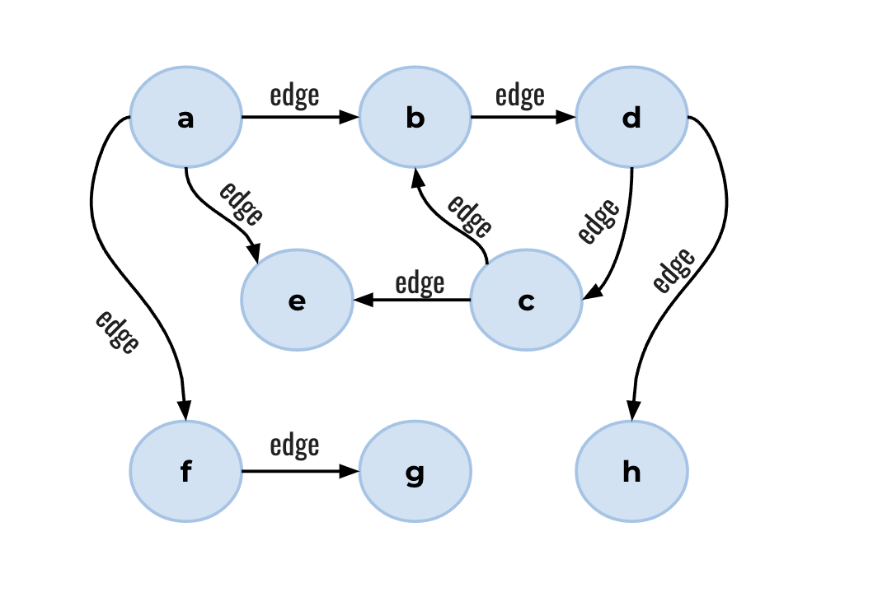

# Recursion

Recursion is the workhorse of Prometheux, and is a pattern that occurs naturally
in many situations. In all recursive cases, there is :

1. a recursive case, where a predicate is derived by itself, and
2. a base case, which must not be derivable by itself, allowing the recursion to terminate.

Consider a graph of nodes and edges between them. A path can be defined as:

1. A simple edge between 2 nodes.
2. The list of such edges between any 2 nodes, via N-2 other nodes.

```prolog showLineNumbers
path(Start, End) :- edge(Start, End). % Base case
path(Start, End) :- path(Start, Via), edge(Via, End). % Recursive case
```

See how `path` can be a simple hop from one node to another, or requires
2 hops (via 1 intermediate node), or via 3 hops (via 2 intermediate nodes).

### Transitive Closure

The task of finding out all pairs of nodes in a graph that are connected to each other either directly or indirectly is known as [transitive closure](https://en.wikipedia.org/wiki/Transitive_closure). You might think of this asking if it's possible to fly from some airport to another in one or more direct flights.

Consider the following small graph:



```prolog showLineNumbers
edge("a","b").
edge("a","e").
edge("a","f").
edge("b","d").
edge("c","b").
edge("c","e").
edge("d","c").
edge("d","h").
edge("f","g").

% base case: if there is and edge from the node X to the node Y then there is a path from X to Y %
path(X,Y) :- edge(X,Y).

% recursive case: if there is a path from the node X to the node Y and there is an edge from the node Y to the node Z, then there is a path from the node X to the node Z %
path(X,Z) :- path(X,Y),edge(Y,Z).

@output("path").
```

After execution, the relation `path` contains the following tuples:

```
% Output of path(X,Z)
path("a","e").
path("b","d").
path("f","g").
path("c","b").
path("d","h").
path("a","b").
path("a","f").
path("c","e").
path("d","c").
path("c","d").
path("a","g").
path("d","b").
path("b","h").
path("b","c").
path("a","d").
path("d","e").
path("b","b").
path("c","c").
path("d","d").
path("a","c").
path("b","e").
path("c","h").
path("a","h").
```
From `a`, you can arrive at any other node. However, from `b`, you may only visit `c`,`d`,`e` and `h`.