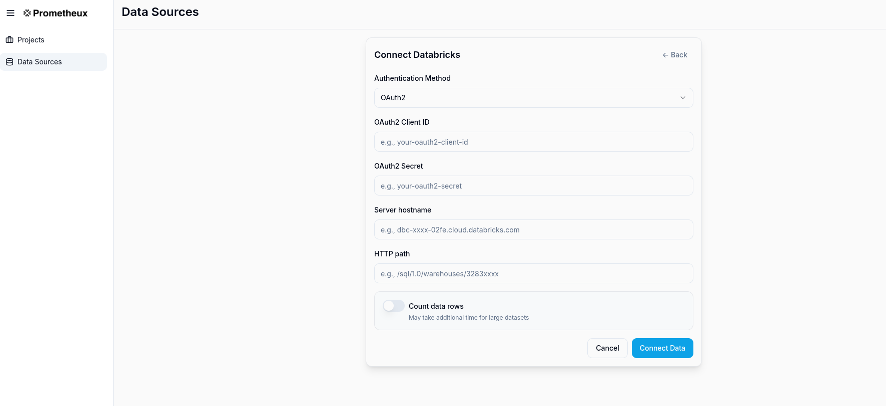

# Prometheux on Databricks

Prometheux integrates with Databricks through JDBC connectivity across all major cloud platforms (AWS, Azure, and Google Cloud), allowing you to execute Vadalog rules against Unity Catalog tables and SQL warehouses. This integration provides secure, governed access to your lakehouse data while maintaining performance and scalability regardless of your cloud provider.

## JDBC Configuration

Prometheux connects to Databricks using the OSS JDBC driver with OAuth 2.0 Machine-to-Machine (M2M) authentication. This approach provides secure, token-managed connectivity without manual token handling across all supported cloud platforms.

### Multi-Cloud Platform Support

Prometheux supports Databricks deployments on all major cloud platforms:

- **AWS (Amazon Web Services)**: `dbc-xxxxxxxx-xxxx.cloud.databricks.com`
- **Microsoft Azure**: `adb-xxxxxxxx-xx.x.azuredatabricks.net`
- **Google Cloud Platform**: `xxxxxxxx-xxxx.x.gcp.databricks.com`

The connection configuration remains consistent across all platforms, with only the hostname format varying by cloud provider.

### Authentication Options

#### Option 1: OAuth 2.0 M2M (Recommended)

Configure OAuth authentication using client credentials provided by your Databricks administrator:

```properties
# Databricks JDBC OAuth Configuration
databricks.host=<workspace-hostname>
databricks.httpPath=/sql/1.0/warehouses/<warehouse-id>
databricks.oauth2.clientId=<client-id>
databricks.oauth2.clientSecret=<client-secret>

# Connection string automatically constructed:
# jdbc:databricks://<host>:443;<http-path>;AuthMech=11;Auth_Flow=1;OAuth2ClientId=<client-id>;OAuth2Secret=<client-secret>
```

#### Option 2: Personal Access Token

For development environments, you can use personal access tokens:

```properties
# Databricks JDBC Token Configuration
databricks.host=<workspace-hostname>
databricks.httpPath=/sql/1.0/warehouses/<warehouse-id>
databricks.token=<personal-access-token>
databricks.authMode=PAT
```

### UI-Based Configuration

Prometheux provides a user-friendly configuration interface for setting up Databricks connectivity. The data source connection dialog supports both OAuth and Personal Access Token authentication methods:



**Configuration Fields:**

1. **Database Type**: Select "Databricks" from the dropdown
2. **Client ID**: 
   - For OAuth: Enter your OAuth client ID (e.g., `e5f1e15e-xxxx-xxxx-xxxx-2ed89291cc1c`)
   - For PAT: Leave this field empty
3. **Secret/PAT**: Enter your OAuth client secret or Personal Access Token (automatically masked for security)
4. **Host**: Enter your Databricks workspace hostname based on your cloud platform:
   - **AWS**: `dbc-xxxxxxxx-xxxx.cloud.databricks.com`
   - **Azure**: `adb-xxxxxxxx-xx.x.azuredatabricks.net`
   - **GCP**: `xxxxxxxx-xxxx.x.gcp.databricks.com`
5. **Port**: Default is 443 for HTTPS connections
6. **Warehouse**: Enter the SQL warehouse HTTP path (e.g., `/sql/1.0/warehouses/f66xxxxxxxxxxxxx`)
7. **Additional Options (JSON)**: Provide additional JDBC parameters as needed

**Optional Authentication Configuration:**

**For OAuth (Default):**
```json
{
  "region": "us-east-1",
  "ConnTimeout": "10000",
  "SocketTimeout": "10000"
}
```

**For Personal Access Token:**
```json
{
  "authMode": "PAT",
  "region": "us-east-1",
  "ConnTimeout": "10000",
  "SocketTimeout": "10000"
}
```

**Cloud-Specific Examples:**
- **AWS**: `{"region": "us-east-1"}`
- **Azure**: `{"region": "eastus"}`
- **GCP**: `{"region": "us-central1"}`

**Security Features:**
- **Credential Masking**: Secrets and PATs are automatically redacted in the UI
- **Dual Authentication**: Supports both OAuth and PAT authentication methods
- **Vault Integration**: Supports pulling credentials from external secret managers
- **Connection Testing**: Built-in connectivity validation before saving

### JDBC Driver Setup

Prometheux uses the open-source Databricks JDBC driver for optimal performance and compatibility:

```xml
<!-- Maven dependency for OSS JDBC driver -->
<dependency>
    <groupId>com.databricks</groupId>
    <artifactId>databricks-jdbc</artifactId>
    <version>1.0.10-oss</version>
</dependency>
```

## Data Operations

### Reading from Unity Catalog

Configure input tables using Unity Catalog three-level namespace:

```prolog
% Input configuration for Unity Catalog tables
@bind("customers", "databricks", "sales_catalog.crm_schema", "customers").

@bind("orders", "databricks", "sales_catalog.transactions_schema", "orders").

% Vadalog rule using Unity Catalog data
customer_orders(CustomerName, OrderId, OrderDate, Amount) :- 
    customers(CustomerId, CustomerName, Email),
    orders(OrderId, CustomerId, OrderDate, Amount).

@output("customer_orders").
@bind("customer_orders", "databricks", "analytics_catalog.reports_schema", "customer_orders").
```

### Running in Databricks Notebooks

Prometheux can be executed directly within Databricks notebooks for interactive analysis and development. This approach is ideal for data scientists and analysts who want to combine Vadalog reasoning with Spark's computational capabilities.

#### Graph Analytics Example

Here's a complete example demonstrating how to perform graph analytics using Prometheux in a Databricks notebook. This example computes all shortest paths between airports using flight route data:

```scala
%scala
val tableName = "air_routes_edges"
val outputTable = "all_shortest_paths_routes"

val program = s"""
  @bind("air_routes","databricks inCluster=true","","prometheux_workspace.default.$tableName").
  edge(From, To, Dist) :- 
    air_routes(Id, From, To,Label,Dist).

  all_shortest_paths_routes(From,To,Distance) :- #ASP(edge).
  
  @output("all_shortest_paths_routes"). 
  @bind("all_shortest_paths_routes","databricks inCluster=true","","$outputTable").
"""

val args = Array(program)
uk.co.prometheux.prometheuxreasoner.PrometheuxReasonerMain.main(args)
```

**Key Features of In-Cluster Execution:**

- **`inCluster=true`**: Enables direct access to Spark tables without JDBC overhead
- **Dynamic Table Names**: Use Scala string interpolation for flexible table references
- **Unity Catalog Support**: Access tables using three-level namespace (`catalog.schema.table`)
- **Immediate Results**: Output tables are created directly in the cluster

#### Notebook Setup Requirements

Before running Prometheux in a Databricks notebook, ensure:

1. **Prometheux JAR Installation**: Upload the Prometheux JAR to your cluster
2. **Cluster Configuration**: Configure the cluster with appropriate Spark settings
3. **Data Preparation**: Ensure input tables exist with the correct schema

**Sample Data Schema:**
```sql
CREATE TABLE prometheux_workspace.default.air_routes_edges (
  Id INT,
  From STRING,
  To STRING,
  Label STRING,
  Dist DOUBLE
) USING DELTA;
```

#### Advanced Notebook Patterns

**Multi-Step Analysis:**
```scala
%scala
// Step 1: Data preprocessing
val preprocessProgram = s"""
  @bind("raw_routes","databricks inCluster=true","","raw_flight_data").
  
  clean_routes(From, To, Distance) :- 
    raw_routes(_, From, To, _, Distance),
    Distance > 0.
  
  @output("clean_routes").
  @bind("clean_routes","databricks inCluster=true","","clean_air_routes").
"""

// Step 2: Graph analysis
val analysisProgram = s"""
  @bind("routes","databricks inCluster=true","","clean_air_routes").
  
  edge(From, To, Dist) :- routes(From, To, Dist).
  shortest_path(From, To, MinDist) :- #ASP(edge).
  
  @output("shortest_path").
  @bind("shortest_path","databricks inCluster=true","","flight_shortest_paths").
"""

// Execute both steps
uk.co.prometheux.prometheuxreasoner.PrometheuxReasonerMain.main(Array(preprocessProgram))
uk.co.prometheux.prometheuxreasoner.PrometheuxReasonerMain.main(Array(analysisProgram))
```

**Result Visualization:**
```scala
%sql
-- Visualize results directly in Databricks
SELECT From, To, Distance 
FROM all_shortest_paths_routes 
WHERE Distance < 1000 
ORDER BY Distance 
LIMIT 100
```

## Security and Governance

### Unity Catalog Integration

Prometheux fully respects Unity Catalog governance policies:

- **Access Control**: User permissions are enforced through JDBC connections
- **Data Lineage**: Query execution is tracked in Unity Catalog
- **Audit Logging**: All data access is logged for compliance
- **Schema Evolution**: Automatic handling of table schema changes

### Credential Management

**Production Deployment:**
- Store client secrets in external vault systems (Azure Key Vault, AWS Secrets Manager, HashiCorp Vault)
- Reference secrets through environment variables or vault integrations
- Rotate credentials regularly through automated processes

**Development Environment:**
- Use personal access tokens with limited scopes
- Configure token expiration policies
- Enable IP allowlisting for additional security

### Best Practices

- **Use SQL Warehouses**: Leverage serverless SQL warehouses for optimal performance
- **Partition Awareness**: Prometheux respects table partitioning for efficient queries  
- **Result Caching**: Automatic caching of intermediate query results
- **Batch Processing**: Optimal batch sizes for JDBC operations

## Troubleshooting

### Common Connection Issues

1. **Authentication Failures**
   - Verify client ID and secret are correct
   - Check OAuth scope permissions
   - Ensure workspace access is granted

2. **Network Connectivity**
   - Validate hostname and HTTP path
   - Check firewall rules and IP allowlists
   - Test JDBC connection independently

3. **Permission Errors**
   - Verify Unity Catalog table permissions
   - Check schema and catalog access rights
   - Review service principal assignments