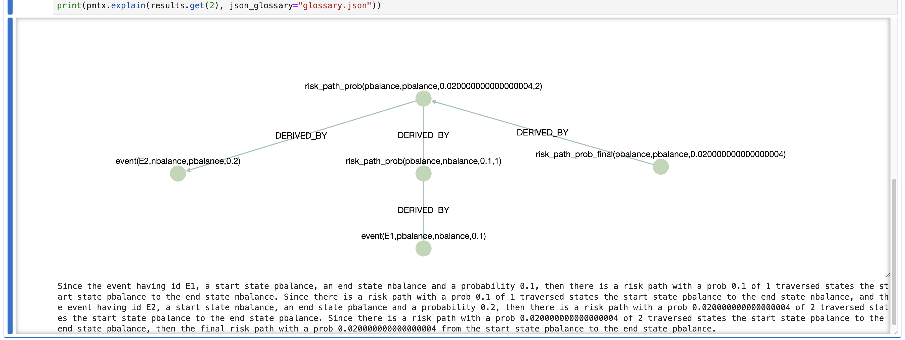

# explainer

---

**Module**: `prometheux_chain.explanation.explainer`

## Functions

```python
def explain(structured_fact: logic.Fact = None,
            fact = None,
            csv_path = None,
            json_glossary = None,
            nl_explanation: bool = False,
            user_prompt: Optional[str] = None) -> String
```

Generates a textual and a visual explanation for a given fact after the reasoning process.

**Parameters:**

- `structured_fact` (prometheux_chain.logic.Fact.Fact, optional): A structured fact object.
- `fact` (any, optional): A raw fact that needs explanation.
- `csv_path` (str, optional): Path to a CSV file containing the step-by-step reasoning to get the explanation from.
- `json_glossary` (str, optional): Path to a JSON file containing natural language descriptions of predicates.
- `nl_explanation` (bool, optional): A flag indicating whether the textual explanation should be structured using logic facts or refined into natural language (NL), possibly via an LLM.
- `user_prompt` (str, optional): An additional prompt provided by the user to customize the LLM's behavior when generating natural language explanations.

**Returns:**

- `String`: A textual explanation of the fact of interest.

### Example with natural language explanation and user prompt:
```python
print(pmtx.explain(
    fact="expected_loss(B,8.07)",
    nl_explanation=True,
    user_prompt="Use technical language appropriate for a data scientist audience"
))
```
The step-by-step explanation of the result produced by the reasoning process can be visualized in JupyterLab


