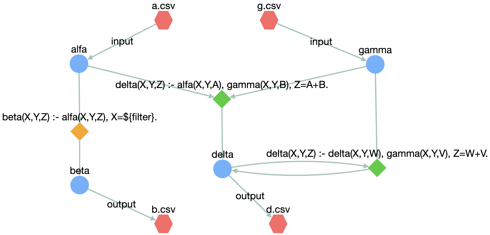

# Visualizer

The `visualizer` module provides functions to visualize Vadalog schemas (i.e., to see how the concepts, rules, inputs, and outputs are connected). The `visualize_schema` function reads a `.vada` file, builds its corresponding schema in the backend, and then renders it. Depending on your environment (local Python script or Jupyter notebook), it will automatically choose an appropriate visualization library (PyVis or Cytoscape).

---

## Function

```python
def visualize_schema(vada_file_path: str):
"""
Reads a Vadalog file, extracts its content, and sends it to the /api/visualize endpoint.
Automatically chooses the visualization method based on the environment.
"""
...
```

**Parameters**
- **vada_file_path** _(str)_:  
  Path to the `.vada` file that contains Vadalog rules and data bindings.

**Behavior**
- Attempts to open and read the `.vada` file from the provided path.
- Sends the file content to an API endpoint for parsing.
- Retrieves the graph structure (nodes and edges) and visualizes them with either:
    - [ipycytoscape](https://github.com/cytoscape/ipycytoscape) if in a Jupyter environment.
    - [PyVis](https://pyvis.readthedocs.io/) otherwise.

**Raises**
- **Exception** if:
    1. The `.vada` file cannot be opened or read.
    2. The API returns an error or fails to provide a valid graph structure.
    3. An unexpected error occurs during visualization.

---

## Example (Python)

Below is an example of how you might use the `visualize_schema` function in a Python script or notebook:

```python
import prometheux_chain as pmtx
import os

# Set your PMTX token for authentication
os.environ['PMTX_TOKEN'] = 'my_pmtx_token'

# Provide the path to your .vada file
vada_file_path = "path/to/file.vada"

# Call the visualization function
pmtx.visualize_schema(vada_file_path)
```

---

## Example

Given the following `.vada` file

```prolog
@input("alfa").
@bind("alfa","csv multiline=true, useHeaders=true","/path/to/your/workdir","a.csv").
@input("gamma").
@bind("gamma","csv multiline=true, useHeaders=true","/path/to/your/workdir","g.csv").

beta(X, Y, Z) :- alfa(X, Y, Z), X = ${filter}.
delta(X, Y, Z) :- alfa(X, Y, A), gamma(X, Y, B), Z = A + B.
delta(X, Y, Z) :- delta(X, Y, W), gamma(X, Y, V), Z = W + V.

@output("beta").
@bind("beta","csv multiline=true, useHeaders=true","/path/to/your/workdir","b.csv").
@output("delta").
@bind("delta","csv multiline=true, useHeaders=true","/path/to/your/workdir","d.csv").
```

the resulting visualization is provided below

